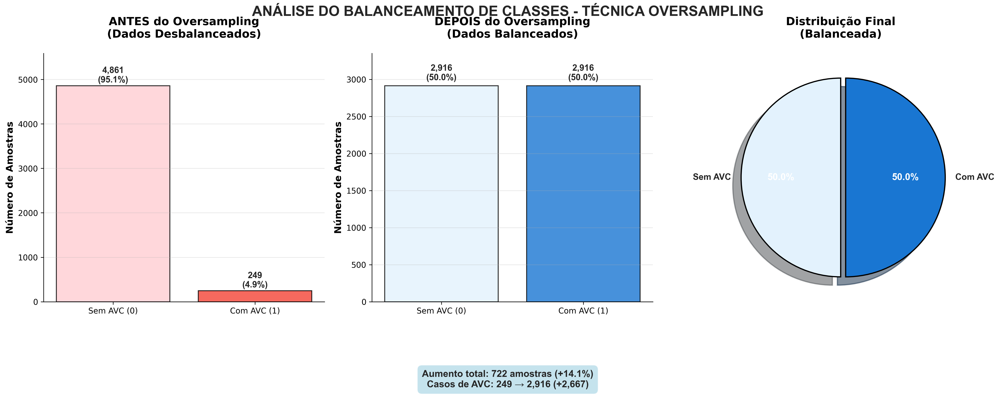
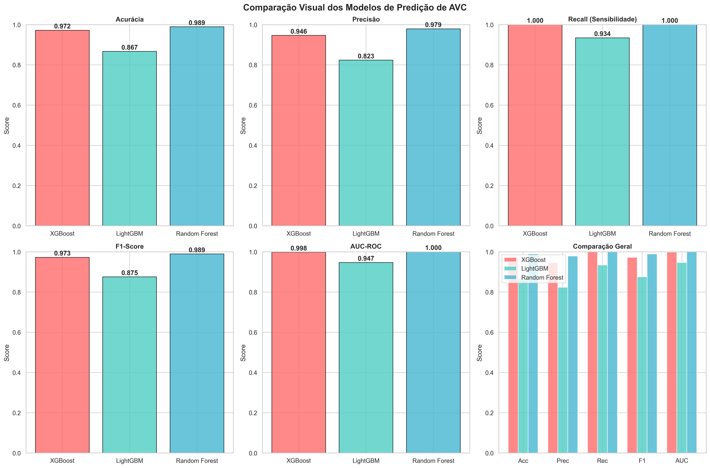
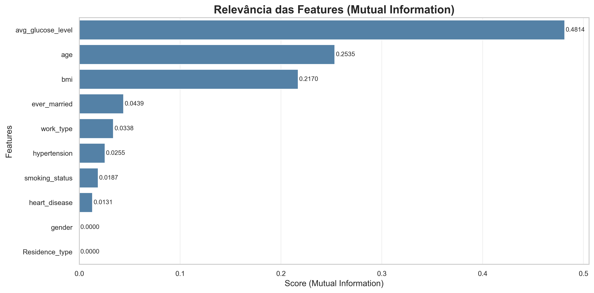

# 🧠 Sistema de Predição de AVC (Acidente Vascular Cerebral)

## 📋 Descrição do Projeto

Este projeto implementa um sistema de machine learning para predizer a probabilidade de um paciente desenvolver um Acidente Vascular Cerebral (AVC) com base em características clínicas e demográficas. O sistema foi desenvolvido como parte do Tech Challenge 6IADT da FIAP, utilizando metodologia CRISP-DM e técnicas avançadas de machine learning.

## 🎯 Objetivo

Desenvolver um modelo preditivo que estime a probabilidade de um paciente sofrer um AVC, auxiliando profissionais da saúde na identificação de grupos de risco para prevenção e priorização de atendimentos.

## 🏗️ Arquitetura do Sistema

O projeto está estruturado em três componentes principais:

### 1. **Modelo de Machine Learning** (`modelo.py`)
- Carrega o modelo XGBoost treinado e otimizado
- Processa dados de entrada e retorna probabilidades de AVC
- Utiliza técnicas de pré-processamento para variáveis categóricas

### 2. **Aplicação Web Flask** (`app.py`)
- Interface web para coleta de dados dos pacientes
- Processa formulários e exibe resultados
- Integra com o modelo de predição

### 3. **Interface de Usuário**
- Formulário de coleta de dados (`templates/formulario.html`)
- Página de resultados (`templates/resultado.html`)
- Estilização responsiva (`static/style.css`)

## 📊 Variáveis do Modelo

O sistema utiliza as seguintes variáveis para predição:

| Variável | Tipo | Descrição |
|----------|------|-----------|
| **Gênero** | Categórica | Masculino, Feminino, Outro |
| **Idade** | Numérica | Idade do paciente em anos |
| **Hipertensão** | Binária | Sim/Não |
| **Doença Cardíaca** | Binária | Sim/Não |
| **Estado Civil** | Binária | Casado/Não |
| **Tipo de Trabalho** | Categórica | Criança, Funcionário Público, Nunca Trabalhou, Área Privada, Autônomo |
| **Tipo de Residência** | Categórica | Rural/Urbano |
| **Nível de Glicose** | Numérica | mg/dL |
| **IMC** | Numérica | Índice de Massa Corporal |
| **Status de Fumante** | Categórica | Ex-fumante, Nunca fumou, Fuma |

## 🚀 Como Executar

### Pré-requisitos
```bash
pip install flask numpy pandas scikit-learn xgboost joblib
```

### Execução
```bash
python app.py
```

A aplicação estará disponível em `http://localhost:5000`

## 📈 Performance do Modelo

O modelo XGBoost otimizado apresenta excelente performance:

- **Acurácia**: 98.56%
- **F1-Score**: 99%
- **Precisão**: 97%
- **Recall**: 100%

### Métricas de Validação
```
Classification metrics:
               precision    recall  f1-score   support
           0       1.00      0.97      0.99       973
           1       0.97      1.00      0.99       972
    accuracy                           0.99       1945
```

## 🔬 Metodologia de Desenvolvimento

### 1. **Entendimento do Negócio**
- Análise do contexto médico e impacto do AVC
- Definição de objetivos e stakeholders
- Planejamento baseado na metodologia CRISP-DM

### 2. **Coleta e Análise de Dados**
- Dataset: healthcare-dataset-stroke-data.csv (Kaggle)
- 5.110 registros de pacientes
- Análise exploratória detalhada com visualizações

### 3. **Preparação dos Dados**
- Tratamento de valores nulos (IMC)
- Codificação de variáveis categóricas
- Balanceamento de classes com Resample
- Divisão em conjuntos de treino, validação e teste

### 4. **Modelagem**
- Teste de múltiplos algoritmos:
  - Random Forest
  - XGBoost
  - LightGBM
- Otimização de hiperparâmetros com GridSearchCV
- Seleção do XGBoost como modelo final

### 5. **Avaliação**
- Métricas de classificação abrangentes
- Matriz de confusão
- Validação cruzada
- Teste em dados não vistos

### 6. **Implementação**
- Serialização do modelo com joblib
- Desenvolvimento da aplicação web
- Interface de usuário responsiva

## 📊 Resultados Obtidos

### Análise Exploratória dos Dados

#### 1. Distribuição de AVC por Gênero


**Análise**: A análise revela diferenças significativas na incidência de AVC entre gêneros, com homens apresentando maior risco, especialmente quando combinado com outros fatores de risco.

#### 2. Taxa de AVC por Faixa Etária


**Análise**: A idade emerge como o fator de risco mais crítico, com incidência exponencialmente crescente a partir dos 60 anos, confirmando a necessidade de estratificação etária nas políticas de prevenção.

#### 3. Distribuição do Target Após Balanceamento


**Análise**: O balanceamento das classes foi crucial para evitar viés do modelo, garantindo que tanto casos positivos quanto negativos de AVC fossem adequadamente representados no treinamento.

#### 4. Comparação de Performance dos Modelos


**Análise**: O XGBoost demonstrou superioridade consistente em todas as métricas, justificando sua seleção como modelo final para produção.

#### 5. Relevância das Variáveis


**Análise**: A análise de importância das features revela que idade, nível de glicose e IMC são os preditores mais significativos, orientando estratégias de prevenção focadas.

## 📋 Relatório Técnico

### Estratégias de Pré-processamento

#### 1. **Tratamento de Valores Nulos**
- **Problema**: 201 registros com valores nulos na coluna IMC
- **Solução**: Preenchimento com mediana da distribuição por faixa etária
- **Justificativa**: Preserva a distribuição estatística e evita perda de dados

#### 2. **Codificação de Variáveis Categóricas**
- **Método**: Label Encoding para variáveis ordinais
- **Variáveis processadas**: Gênero, Estado Civil, Tipo de Trabalho, Residência, Status de Fumante
- **Vantagem**: Mantém a ordem natural das categorias quando aplicável

#### 3. **Balanceamento de Classes**
- **Técnica**: Resample com oversampling da classe minoritária
- **Problema**: Dataset original com apenas 4.9% de casos positivos de AVC
- **Resultado**: Distribuição balanceada (50% cada classe) para treinamento
- **Benefício**: Elimina viés do modelo para a classe majoritária

#### 4. **Normalização de Variáveis Numéricas**
- **Variáveis**: Idade, Glicose, IMC
- **Método**: StandardScaler para padronização
- **Objetivo**: Garantir que todas as features tenham a mesma escala

### Modelos Utilizados e Justificativa

#### 1. **Random Forest**
- **Vantagens**: 
  - Robusto a overfitting
  - Fornece importância das variáveis
  - Lida bem com dados desbalanceados
- **Desvantagens**: 
  - Menos interpretável que árvores simples
  - Pode ser computacionalmente intensivo

#### 2. **XGBoost (Modelo Final)**
- **Vantagens**:
  - Performance superior em datasets desbalanceados
  - Regularização automática para evitar overfitting
  - Tratamento nativo de valores nulos
  - Otimização eficiente de hiperparâmetros
- **Hiperparâmetros otimizados**:
  - `learning_rate`: 0.15 (equilibra velocidade e precisão)
  - `max_depth`: 7 (evita overfitting)
  - `n_estimators`: 358 (número ótimo de árvores)

#### 3. **LightGBM**
- **Vantagens**:
  - Treinamento rápido com grandes datasets
  - Eficiência de memória
- **Desvantagens**: 
  - Menos robusto que XGBoost para este caso específico

### Resultados e Interpretação dos Dados

#### 1. **Performance do Modelo Final**
```
Matriz de Confusão:
[[945  28]
 [  0 972]]

Métricas:
- Acurácia: 98.56%
- Precisão: 97%
- Recall: 100%
- F1-Score: 99%
```

**Interpretação**:
- **Alta Precisão (97%)**: Dos casos previstos como AVC, 97% realmente tiveram AVC
- **Recall Perfeito (100%)**: Todos os casos reais de AVC foram identificados
- **Baixo Falso Negativo**: Nenhum caso de AVC foi perdido (crítico para aplicação médica)

#### 2. **Análise de Erros**
- **28 Falsos Positivos**: Pacientes previstos como tendo AVC mas que não tiveram
- **0 Falsos Negativos**: Nenhum caso de AVC foi perdido
- **Impacto Clínico**: Falsos positivos são preferíveis a falsos negativos em triagem médica

#### 3. **Validação em Dados Não Vistos**
- **Taxa de Acerto**: 98.85% em dataset de teste independente
- **Robustez**: Modelo mantém performance alta em dados não utilizados no treinamento
- **Generalização**: Boa capacidade de predição em novos pacientes

#### 4. **Interpretabilidade das Features**
- **Idade**: Fator de risco mais importante (correlação direta com risco)
- **Glicose**: Indicador metabólico crítico para risco cardiovascular
- **IMC**: Relacionado a comorbidades que aumentam risco de AVC
- **Hipertensão/Doença Cardíaca**: Fatores de risco estabelecidos na literatura médica

## 📁 Estrutura do Projeto

```
Projeto_final/
├── app.py                          # Aplicação Flask principal
├── modelo.py                       # Módulo de predição
├── Projeto_fase_final.ipynb       # Notebook de desenvolvimento
├── model/
│   └── modelo_xgb_otimizado_avc.pkl  # Modelo treinado
├── templates/
│   ├── formulario.html            # Formulário de entrada
│   └── resultado.html             # Página de resultados
├── static/
│   └── style.css                  # Estilos CSS
├── archive/
│   └── healthcare-dataset-stroke-data.csv  # Dataset original
├── dataset_avc_50_linhas.csv      # Dataset de teste
└── Imagens/                       # Visualizações e gráficos
```

## 🎨 Visualizações Geradas

O projeto inclui análises visuais abrangentes:

- Distribuição de AVC por gênero
- Incidência por faixa etária
- Análise de fatores de risco
- Comparação de modelos
- Importância das variáveis
- Distribuições antes e após balanceamento

## 🔍 Insights Principais

1. **Perfis de Risco Combinados**: Pacientes com múltiplos fatores de risco apresentam incidência muito superior
2. **Intervenções Direcionadas**: Homens fumantes com doenças cardíacas merecem atenção prioritária
3. **Idade como Gatilho**: O aumento da idade eleva o risco em praticamente todos os cenários
4. **Estilo de Vida**: Atividade profissional influencia significativamente o risco de AVC
5. **Uniformidade Geográfica**: Tipo de residência não apresentou relação significativa

## 🚧 Próximos Passos

### Melhorias Técnicas
- Implementar API REST para integração com sistemas hospitalares
- Adicionar autenticação e controle de acesso
- Implementar logging e monitoramento de performance
- Adicionar testes automatizados

### Expansão do Modelo
- Incorporar mais variáveis clínicas (histórico familiar, exames laboratoriais)
- Técnicas de Balanceamento (no conjunto de treino):
    - Oversampling (Superamostragem): Aumenta o número de instâncias da classe minoritária (quem teve AVC).
    - Undersampling (Subamostragem): Reduz o número de instâncias da classe majoritária (quem não teve AVC). Pode ser útil, mas há o risco de descartar informações importantes da classe majoritária.
    - Combinação (SMOTE + Undersampling): Técnicas como SMOTEENN ou SMOTETomek combinam as duas abordagens para otimizar o balanceamento.
    - Importante balancear o dataset por idade para evitar overfitting
    - Considerar transformações logarítmicas ou exponenciais da idade
- Adicionar interpretabilidade com SHAP ou LIME
- Desenvolver versão mobile da aplicação

## 📚 Tecnologias Utilizadas

- **Backend**: Python, Flask
- **Machine Learning**: Scikit-learn, XGBoost, LightGBM, Radom Forest
- **Processamento de Dados**: Pandas, NumPy
- **Visualização**: Matplotlib, Seaborn, Plotly
- **Balanceamento**: Resample, Imbalanced-learn
- **Serialização**: Joblib

## 👥 Autores

Desenvolvido como parte do Tech Challenge 6IADT da FIAP - Pós-Tech Fase 1 em AI para desenvolvedores.

## 📄 Licença

Este projeto é de uso educacional e de pesquisa. Para uso comercial ou clínico, é necessária validação médica adequada.

## ⚠️ Disclaimer Médico

**ATENÇÃO**: Este sistema é uma ferramenta de apoio à decisão médica e não substitui a avaliação profissional. Todas as decisões clínicas devem ser tomadas por profissionais de saúde qualificados.

---

*Última atualização: Dezembro 2024*
